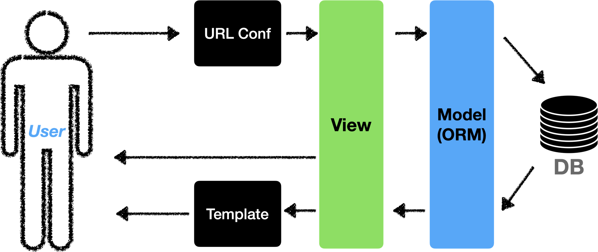
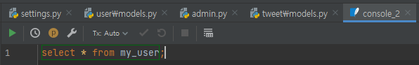

## 스파르타코딩클럽 Django 기초반 2주차

2주차 강의를 모두 수강했다.  
수업에서 나오는 개념보다는 느낀점들을 정리하면서 강의를 들었다.

### Django

강의를 듣다보니 Django는 기존 MVC와 다르다고 배웠던 기억이 났다.  
기존 MVC와 다르게 View대신 장고에서 Template을 쓰고, 기존 MVC의 Controller는 장고의 View다.  
MVC면 MVC로 할 것이지 왜 MTV로 했는지 킹받는다.  

ORM을 구현하는 부분을 보고싶었는데 프레임워크에 내장된 기능을 이용하는 것 같았다.😂    

코드를 수정하고 다시 컴파일 하지 않아도 확인할 수 있다! 이것이 인터프리터 언어의 힘인가!  

python을 자주 사용하지 않아서 자꾸 `;` 을 찍는 실수를 한다.  

아무리 생각해도 `elif` 안 예쁘다. `else if` 로 바꿔주면 안 되나?  

### Pycharm

SQL과 python을 pycharm 하나의 IDE에서 동시에 코딩할 수 있다는 것은 정말 큰 장점인 것 같다.  
나는 Visual Studio와 SSMS를 왔다 갔다 하면서 코딩하는데 이게 은근 귀찮은 작업이다.  

스파르타코딩에서 제공해준 프로모션 코드로는 4개월동안만 무료로 사용할 수 있다.  
역시 돈을 내면 좋은 IDE를 사용할 수 있는 거였구나!!  

pycharm 개발 경험이 꽤 괜찮다. 사이드 프로젝트로 장고 프레임워크를 사용해보는 것도 생각해보면 좋을 것 같다. 아 근데 4개월 밖에 못쓰지...😭  

### 스파르타코딩

코드를 따라 치는데 와 저 사람 타자 되게 빠르다 생각했는데 1.5배속이라는 것을 잊었었다.  

스파르타코딩클럽 강의실 UX 진짜 별로다.  
전체화면하면 코드 스니펫이 안 보이고  
그렇다고 작은 화면으로 보자니 강의영상에서 텍스트가 안 보이고  
매번 배속 설정도 다시 해줘야 하고  

코드 스니펫은 개발을 해본 사람이면 몰라도 처음 하는 사람들에게 좋은 기능인가 모르겠다.  
교수님들도 늘 복붙하지 말고 직접 코딩하는 것을 강조하신다.  
오타도 내서 헤매보기도 하고 직접 IDE의 snippet도 이용해보는 것이 더 좋지 않을까?