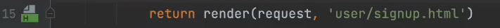
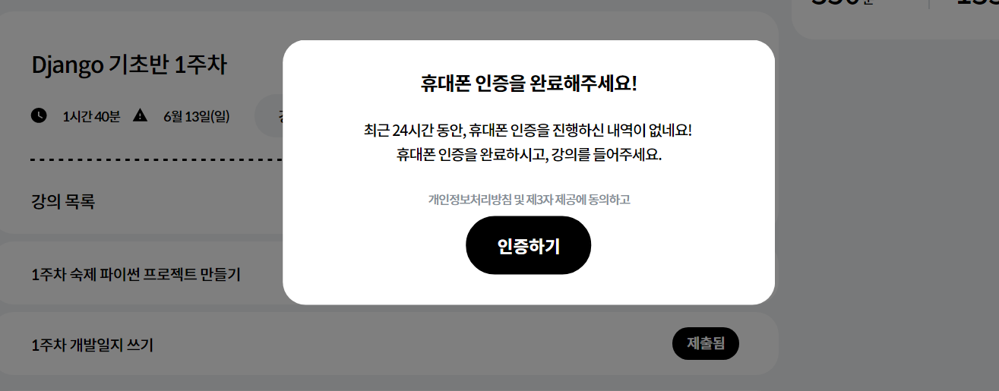
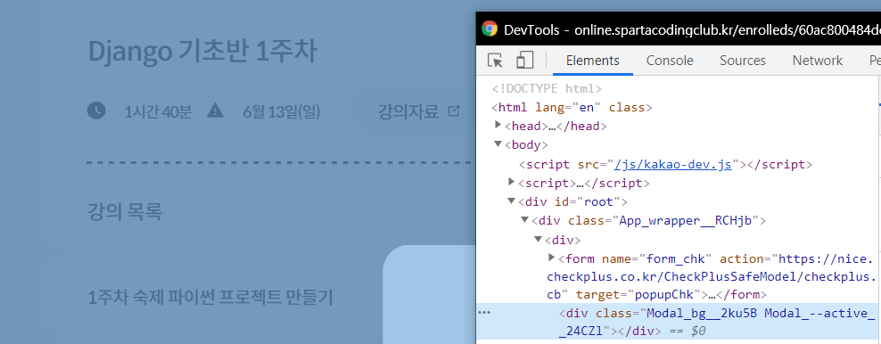

## 스파르타코딩클럽 Django 기초반 3주차

### 과제
3주차 과제를 하는데 이거 처음해본 사람들은 만들 수 있을지 의문이 들었다.  
댓글 목록 조회, 저장, 삭제 기능 구현이었는데 글 id, 댓글 id 모두 `id` 변수 하나로 지정해놔서 초보자들에게 고생 포인트가 되지 않았을까 싶다.  

### Django
팀에서 현재 ORM을 도입하려고 활발히 연구중이다.  
Django에서 ORM을 사용해보니 확실히 편한 부분도 있었지만 우리 제품처럼 여러 개의 테이블을 복잡하게 조인해서 조회하는 부분은 어떻게 구현하는지 보고싶어졌다.  

### pycharm
오늘도 역시나 pycharm의 기능이 놀랍다.  
redirect, render 등을 사용하면 해당 template으로 이동하는 링크를 만들어준다.👍  

그 외에도 vs, vsc에서 extension으로 제공하는 많은 기능들도 기본으로 제공한다(intent 라인 표시, code block 색으로 구별 등)    
다만 html 편집 중에 (Django도 inline expression 이라고 하나?) intellisense를 이용할 수 없는 것은 불편했다.  

### 스파르타코딩클럽
오늘은 갑자기 휴대폰 인증을 하라고 한다.  

혹시나 하고 개발자 모드로 layer를 제거해봤다.  
역시나 강의를 들을 수 있다.  
웹 개발을 가르치면서 이렇게 허술하다니...🤣  

### 강사
"Django에서 이런 기능을 대신 해줍니다. 멋지지 않나요?" 라고 환하게 웃는 모습에서 개발자 다움이 느껴졌다.  
강사 컴퓨터에 pycharm terminal을 보게 되었는데 느낌이 n주차 영상을 하루에 다 끝낸 것 같아 보인다.  
하루를 투자해서 강의를 찍고, 업로드 해놓으면 학생들이 강의를 신청해서 들을 것이고...  
>호오... 이거 꽤 괜찮은데? 나도 한번..?

### 대학교육의 문제점
이번 교육과는 별개로 나는 대학교 교육과정에서 form과 submit 버튼으로 post request를 배워본적이 없다. 배우고 입사했으면 큰 도움이 됐을텐데...😂  
OOP도 그렇고 실무에서 필요한 커리큘럼은 대학교 교육과정에서 왜 안 가르치는지 모르겠다.ㅎㅎ  
그래서 이런 스파르타코딩클럽같은 온라인 교육이나 학원들이 성행하는 것 같다.  

나도 학부생때 연구실 생활을 해봐서 잘 알고있다.  
교수는 teacher가 아니라 researcher라는 것을...