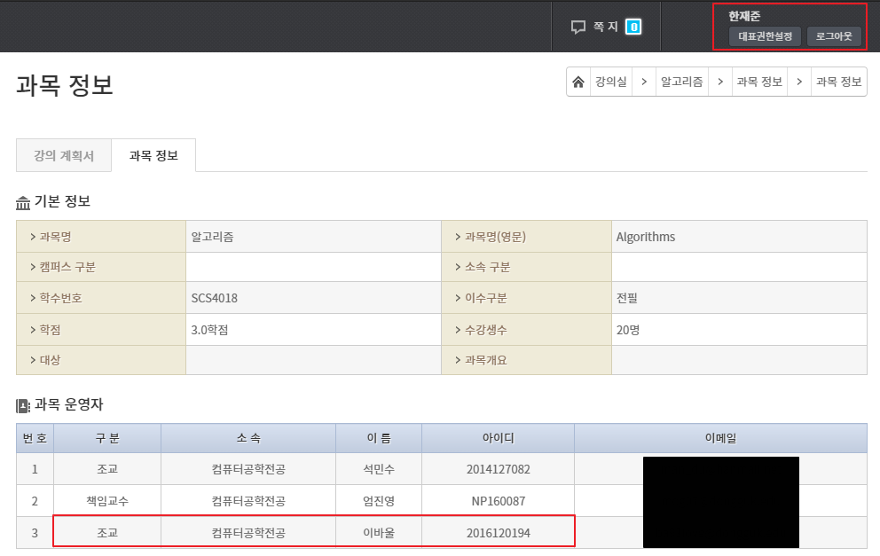

## 스파르타코딩클럽 Django 기초반 4주차

3주차를 듣다가 그냥 4주차도 쭉 다 들어버렸다.

### 과제
4주차 과제는 Github 가입하기와 AWS 가입하기였다.  
5주차엔 Git action을 이용해 AWS로 배포하게 될 것 같다.  
AWS 가입하다가 킹받아서 그만두었다. 필요하면 후배네 회사 아이디로 로그인해야겠다.  

### 스파르타코딩클럽
4주차는 거의 날먹 수준이었다.  
차라리 4주차에 팔로우 기능을 구현하고 배포해서 4주로 끝내지...  
왠지 스파르타코딩클럽의 5주 완성에 억지로 끼워맞춘 느낌이었다.

### 띠용..?
강사가 어느 회사에 재직중인지 궁금해서 찾아봤다.  
'오 이 사람도 서울숲에서 일하는 구나...'  
그리고 학교를 보는데 오잉...??? 갑자기 기억의 조각들이 맞춰지기 시작했다.  
그 환한 웃음... 왠지 나에게 너무 익숙했다.🤣  

  

내가 들었던 알고리즘 수업의 조교였던 것이다.  
심지어 파이썬이나 다른 수업에도 들어왔던 조교였다!  