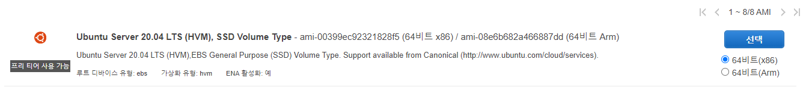
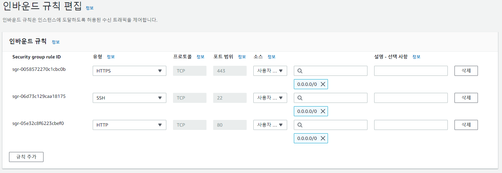
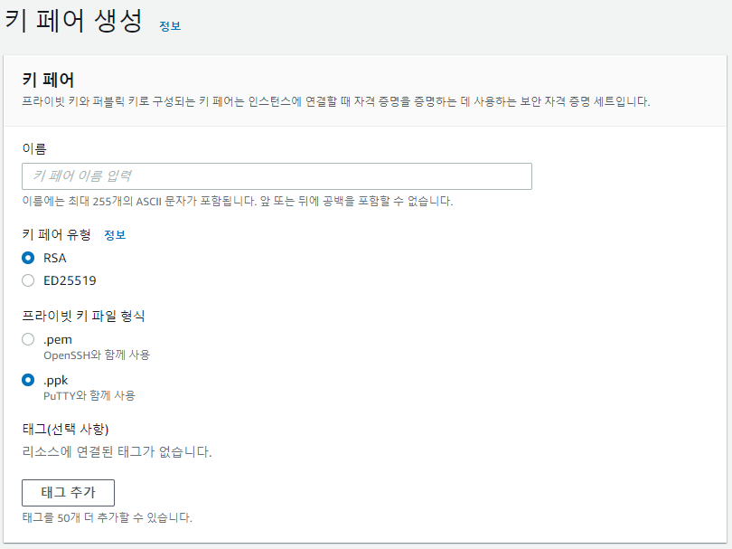
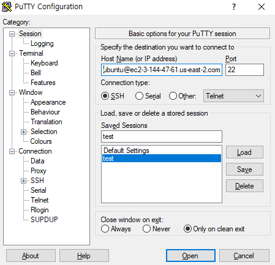
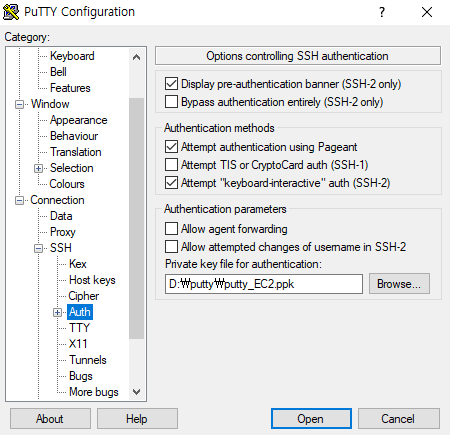

# AWS EC2 Ubuntu 인스턴스 생성하기

## EC2 인스턴스 생성하기  
[AWS 관리 콘솔](https://console.aws.amazon.com/?nc2=h_m_mc)에서 EC2를 선택한다.  
`인스턴스 시작`을 누르고 프리티어 인스턴스를 생성한다.  

### 보안 그룹 인바운드 규칙을 추가한다.  
443 포트로 인바운드되는 HTTPS, 80 포트로 인바운드되는 HTTP 요청을 허용한다.  
- HTTPS, 443 포트, 0.0.0.0/0
- HTTP, 80 포트, 0.0.0.0/0

### 키 페어를 생성한다.  
Putty를 사용할 예정이므로 `.ppk`를 선택한다.

EC2 인스턴스 대시보드에서 `연결` 버튼으로 클릭하면 연결할 수 있으니 생략해도 좋다.

## EC2 인스턴스에 연결하기

### Putty를 설치한다.  
[Putty 다운로드](https://putty.softonic.kr/)  

### Host Name을 설정한다.  
EC2 Ubuntu의 경우 default user name은 `ubuntu`이다([AWS 참고](https://docs.aws.amazon.com/ko_kr/AWSEC2/latest/UserGuide/putty.html)).
- Host Name: `my-instance-user-name@my-instance-public-dns-name`  
  ex) ubuntu@ec2-3-144-47-61.us-east-2.compute.amazonaws.com
- port: 22

### SSH Auth 설정  
Connection - SSH - Auth 탭으로 이동한다.  
Private Key file for auth.에 인스턴스 생성 시 만든 키 페어를 연결한다.  

Open 버튼을 눌러서 연결할 수 있다.  
참고로 세션을 저장해두면 나중에 접속할때도 편하다.  