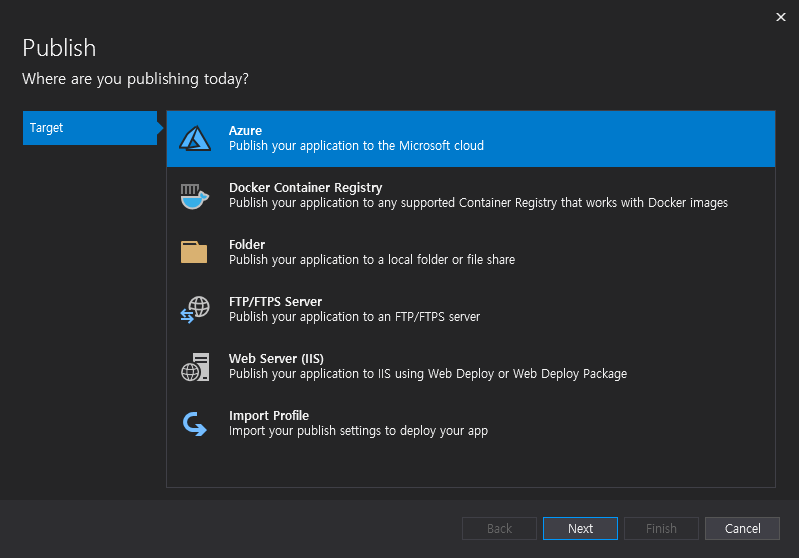
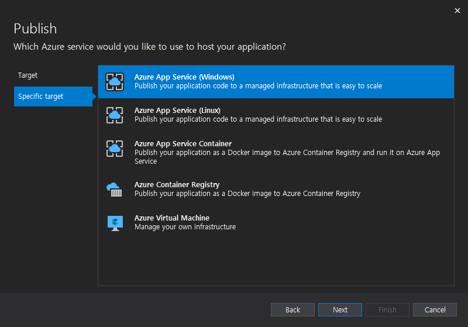
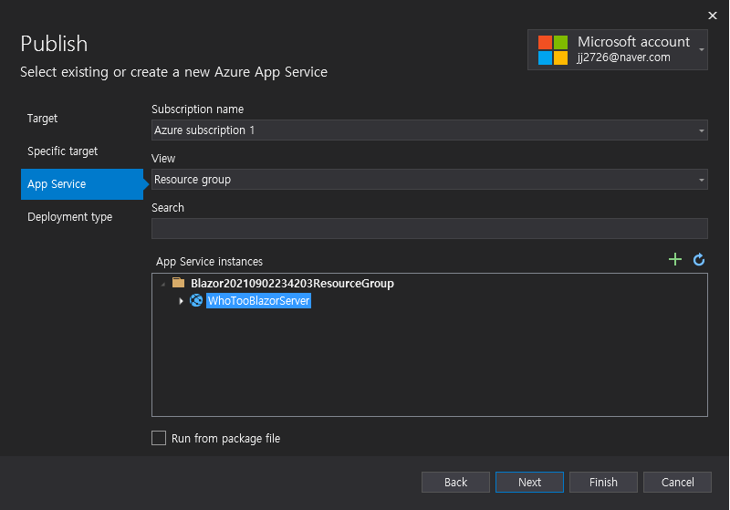
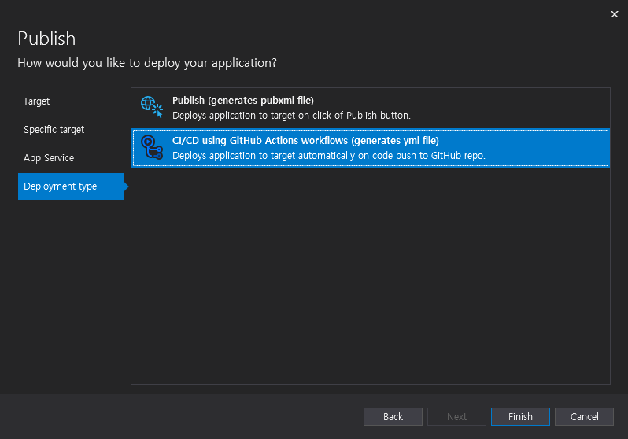
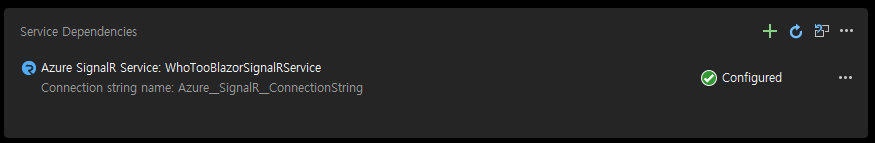

# Azure Blazor Server 배포하기

Visual Studio 2019에서 `Build - Publish <프로젝트명>`을 클릭한다.  

1. Azure로 배포할 예정이니 Azure를 선택한다.

2. Azure App Service를 선택한다.   

3. Azure App Service를 선택한다.  
App Service가 없다면 `+` 버튼을 클릭하면 자동으로 생성된다.

4. 오잉? Github Action으로 CI/CD를 설정해준다...! 해보자.  
`Finish`를 클릭한다.  

5. Service Dependencies 섹션에 Azure SignalR Service를 설정한다.

이게 끝이다.😀 아래 링크에서 action을 배포 내역을 확인 할 수 있다.
- https://github.com/HanJaeJoon/Blazor/actions/workflows/WhoTooBlazorServer.yml
- https://whotooblazorserver.azurewebsites.net/

--- 

Amazon AWS에 배포했던 것과는 차원이 다르다.  
엄청 간단하다. 그도 그럴 것이
Blazor, .NET도 MS  
C#도 MS  
Visual Studio도 MS  
Github도 MS  
Azure도 MS  
이게 착한 독재자(?)의 힘이 아닌가 싶다.

자기 전에 MS 주식을 더 사야겠다.