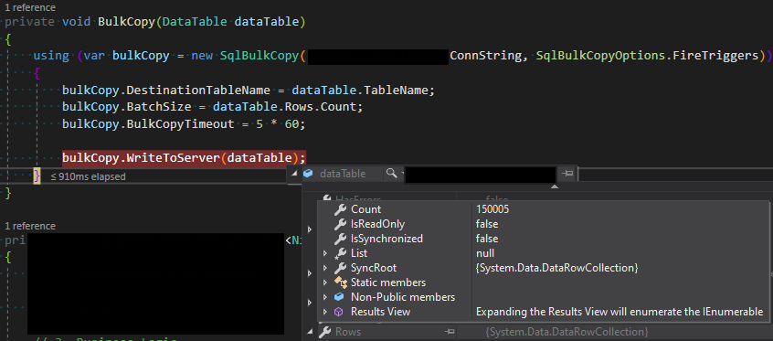

# [.NET] 대량 데이터 Insert하기(SqlBulkCopy.WriteToServer)

최근 결제 모듈의 성능을 개선하는 업무를 하고있다.  
기존의 방식은 몇 만건이 되는 결제를 1건에 1번씩 결제 API를 호출하는 방식이었다.  
우리가 이용하는 PG사에서 너무 버겁다고 항의했다고 한다.  
그래서 대량으로 결제 API로 변경하기로 했다.  

열심히 구현을 하던 중 문제가 발생했다.  
결제 정보를 가져오는 API에서 15만 건의 데이터를 가져와서 DB에 Insert해야 하는데 성능이 나오지 않는 것이다.  
이것저것 시도해보다가 결국 갓택오버플로우의 힘을 빌렸다.  

SqlClient의 [SqlBulkCopy Class](https://docs.microsoft.com/en-us/dotnet/api/system.data.sqlclient.sqlbulkcopy?redirectedfrom=MSDN&view=dotnet-plat-ext-5.0)를 이용하는 방법이 있다고 한다.  
[WriteToServer](https://docs.microsoft.com/en-us/dotnet/api/system.data.sqlclient.sqlbulkcopy.writetoserver?view=dotnet-plat-ext-5.0) method를 이용하여 C# DataTable을 DB 테이블로 bulk로 Insert할 수 있는 기능이었다.  

> 효과는 굉장했다!

dataTable 변수에 입력된 15만 5건의 row를 insert 하는데 910ms가 걸렸다.  
Timeout을 5분으로 설정해놓은 내가 무색해질 정도로 성능이 좋았다.😅  

`SqlBulkCopyOptions.FireTriggers` 옵션을 설정해서 트리거도 실행시킬 수 있었다.

---

현재는 결제 기능에만 활용되지만 앞으로 성능 문제를 일으키는 많은 기능에 활용되면 제품을 많이 개선할 수 있는 발견을 한 것 같아서 기분이 좋다.  