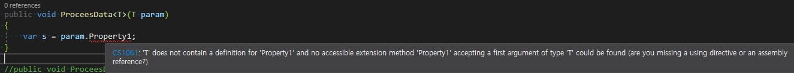

# [.NET] Generic Method의 T(Template) Property 접근하기

Generic Method를 생성했는데 T.Property로 접근할 수 없다.  
다음과 같은 컴파일 에러가 발생한다.  


### 1. Interface를 이용하는 방법
공통 IExample class를 만들고, Generic method에는 `where` generic type constraint로 generic type을 특정해주면 된다.

```
public interface IExample
{
    public int Property1 { get; }
}

public class A : IExample
{
    public int Property1 { get; set; }
    public string A1 { get; set; }
}

public class B : IExample
{
    public int Property1 { get; set; }
    public string B1 { get; set; }
}

public void ProceesData<T>(T param) where T : IExample
{
    var s = param.Property1;
}
```

### 2. Reflection을 이용하는 방법
Interface Class를 만드는 것이 귀찮으면 Reflection을 사용하면 된다.

```
public void ProceesData<T>(T param)
{
    PropertyInfo pi = typeof(T).GetProperty("Property1");

    var s = pi.GetValue(param);
}
```