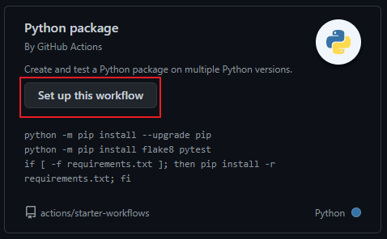
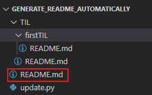
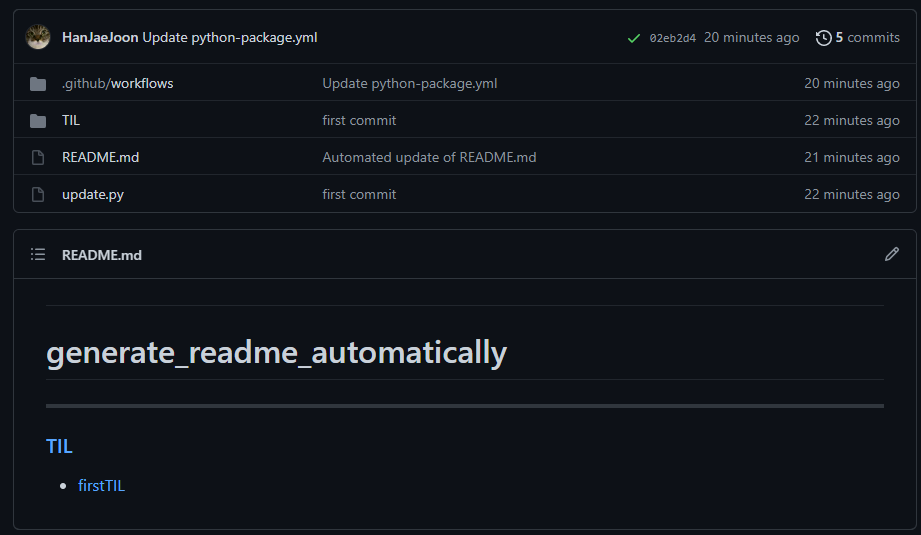
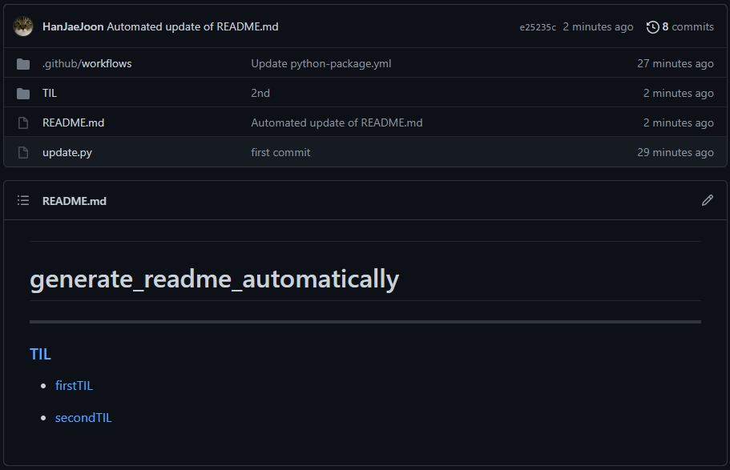

## Github Action으로 자동으로 README.md에 링크 생성하기

블로그에 쓸 내용을 기록할때 Github Action을 이용해서 자동으로 README.md에 링크를 업데이트하도록 만들어놨다.  

TIL을 시작해보려 하는데 비슷하게 구현해놓으면 좋을 것 같아서 Repository를 생성해놨다.  
[Github Action을 이용한 README.md 자동 업데이트](https://github.com/HanJaeJoon/generate_readme_automatically)

1. Action 탭에서 Python package를 누른다.  

2. `python-package.yml` 에 있는 내용을 복사한다.  
   이 파일에서 `update.py`를 실행하고, git commit, push하도록 설정한다.

3. Repository를 보면 TIL 폴더에 README.md가 있고, 그 하위에 firstTIL에도 README.md가 있다. Root에 있는 README(빨간색)의 내용을 다른 폴더의 README의 링크로 자동으로 업데이트 해준다.  

4. push를 하고 기다리면 git action을 통해 자동으로 업데이트 된다.  
   ([git action의 결과는 여기서 확인할 수 있다.](https://github.com/HanJaeJoon/generate_readme_automatically/actions))

5. 두 번째 TIL 폴더를 만들어서 push하면 git action을 통해 리스트에 추가된다.
