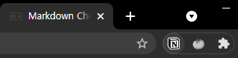
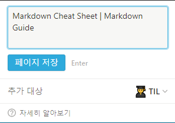
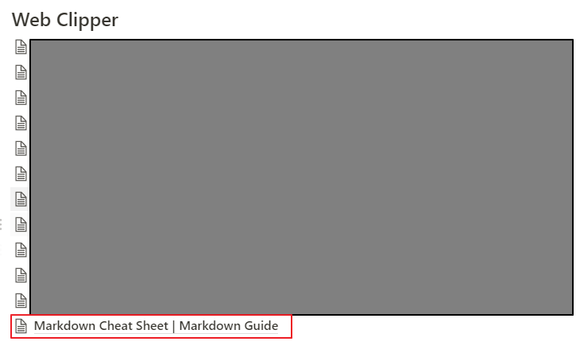

## Notion Web Clipper

나는 Extension 매니아다. visual studio, vs code, chorme 등 좋은 Extension이 있으면 무조건 사용해본다.  
그 중에 블로그 소재 수집용으로 사용하는 [Notion Web Clipper](https://chrome.google.com/webstore/detail/notion-web-clipper/knheggckgoiihginacbkhaalnibhilkk/related?hl=en) 도 있다.  

1. 회사에서 리서치하는 중 좋은 소재가 보이면 옆에 아이콘을 누른다.   

2. 원하는 Notion 경로(추가 대상)에 저장한다.  

3. Notion 페이지에 자동으로 링크가 기록된다.  

문제는 이렇게 Clipper로 모아놓기만 하고 있다는 점이다.  
천천히 하나씩 복습해서 블로그에 올려야겠다.  
사실 이건 세이브 원고였어!  