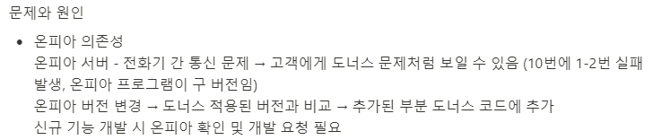

## 아마추어

프로젝트는 아직 끝나지 않았지만, 마이그레이션에 대한 회고만 진행하기로 했다.  
머리를 싸매며 열심히 회고를 작성하고 있는데 쓸 말이 없어서  
직전 프로젝트 회고에는 어떤 내용을 썼나 참고하려다가 발견했다.

[마이그레이션 회고라고 올리고 마이그레이션 얘기는 없는 이 글](https://jjester.tistory.com/56?category=803205)에 적혀 있는 문제가  
예전 회고에서 내가 이미 예상했던 것이었다.  

그들은 버전이 바뀔 것이란 말도 하지 않고 버전을 바꿨고,  
난 버전이 바뀌었다는 것을 CS가 들어온 후에 업체에 물어보고서야 알게 되었다.

우리가 신규 기능 개발 시 그 업체로 확인 요청이 필요한 것처럼,  
그쪽에서 뭔가를 하려면 우리의 확인이 필요하다.  

사회생활 3년차도 예상할 수 있는 문제를 그 회사 팀장과 차장급이 예상을 못했다는 것이다.  
아니면 직급이 낮은 나를 무시했을 수도 있다.  
전자든 후자든 그런 회사와는 일하고 싶지 않다.  

생각해보니 메일로 소통하다가 업체측 문제로 확인되니 CC에서 총괄이사를 몰래 빼버린 것, 여전히 문제를 고치지 못하고 있는 것, 엔지니어의 무능력 등 극혐 투성이었다.

문득 이 글을 그 회사에서 보면 어쩌지? 하는 생각이 들기도 했는데  
나에게도 [테슬라 공시를 보고 배운 스킬](https://www.hankyung.com/it/article/202104291898i)이 있다.