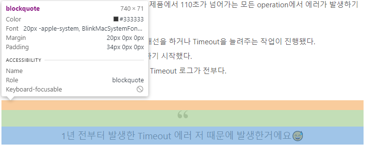
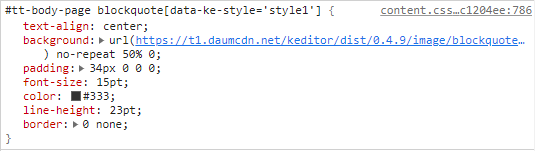
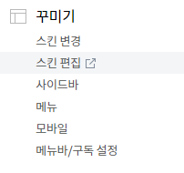
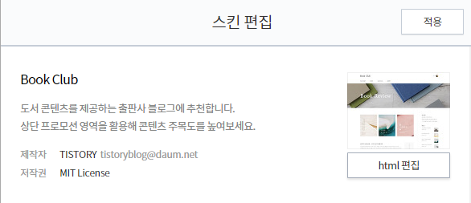
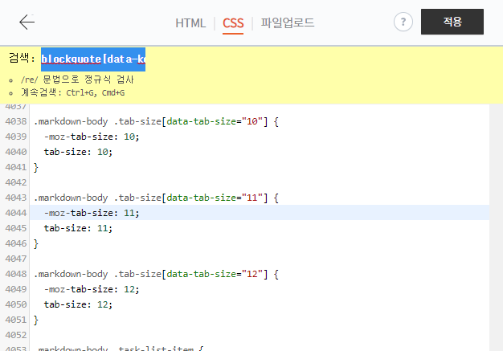
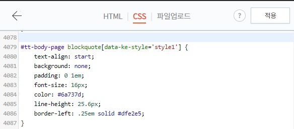

## 티스토리 css

티스토리에 적용해놓은 markdown css가 또 말을 듣지 않는다.  
개같은 저 따옴표..! 킹받게 한 쌍도 아니다.


1. 먼저 css를 확인한다.  


2. 문제가 되는 css를 확인한다.  


`#tt-body-page blockquote[data-ke-style='style1']` 이놈이 문제다.  
이 친구를 제거하기 위해 티스토리 관리 페이지에서 `스킨 편집`을 클릭한다.  


`html 편집`을 클릭한다.  


3. CSS탭에서 검색해도 보이지 않는다.  


**나는 css가 제일 자신없지만 포기하지 않고 노가다로 승부한다.**  

4. 문제가 되는 css를 무력화시키는 아래 css를 입력한다.  
```
#tt-body-page blockquote[data-ke-style='style1'] {
    text-align: start;  
    background: none;  
    padding: 0 1em;  
    font-size: 16px;  
    color: #6a737d;  
    line-height: 25.6px;  
    border-left: .25em solid #dfe2e5;  
}
```

5. 적용 버튼을 누른다.  


6. 끝! 이제야 마크다운같네.  
