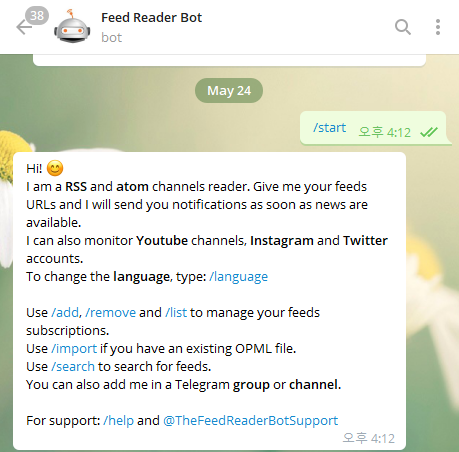

## RSS 피드 구독

좋은 블로그를 찾아서 업로드되는 포스트의 알림을 받고 싶었다.  
검색해보니 텔레그램 봇으로 가능하다고한다.  

바로 `@TheFeedReaderBot` 이다.  
https://t.me/TheFeedReaderBot  
친구 추가를 하고 `/start` 를 입력하면 명령어 설명이 나온다.  
(search 기능이 있다!😮 나중에 구독할만한 RSS 피드가 있나 찾아봐야겠다)  


구독할 블로그의 RSS Feed XML경로를 입력한다. 
**티스토리 블로그 주소 뒤에 `/rss`를 붙이면 된다.**
```
/add https://jjester.tistory.com/rss
```


이제 포스트가 올라오면 텔레그램 봇을 통해 알림이 온다.  
이미지가 본문과 어우러져 나오지 않아서 아쉽다.  
하지만 중요한 것은 글이 업로드되었다 알림이기 때문에 잘 사용하고 있다.   

