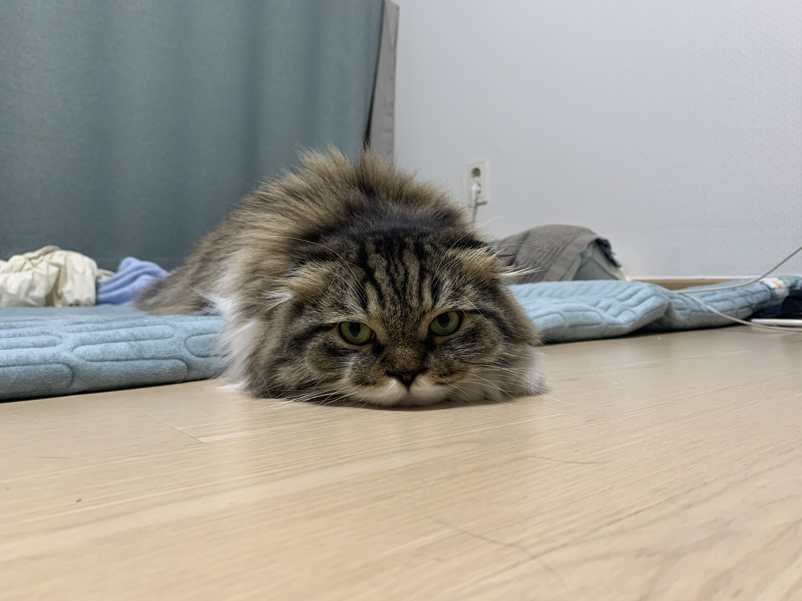

## HTTP status cats

긱뉴스에 HTTP status code를 귀여운 고양이들의 짤로 표현한 [HTTP Cats](https://http.cat/)가 나왔다.  

역시 개발자들은 고양이를 좋아하나보다.

어느 설문조사에서도 개발자들이 강아지보다 고양이를 선호한다고 봤었고,  
Github의 트레이드 마크도 고양이다.

나의 최애 짤은 `401 Unauthorized` 이다.  
제품 에러 페이지에 적용하고싶다.😁

그래도 우리 후추가 최고야!😸  
후추로 http.pepper를 만들어볼까?

