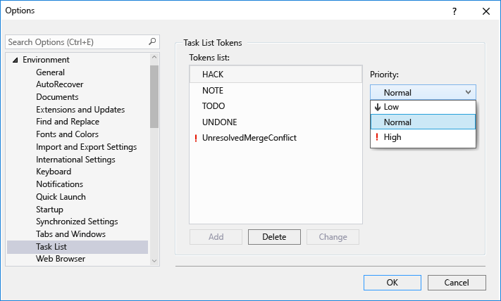
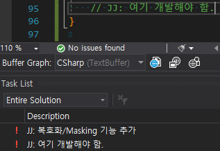

# Visual Studio의 Task List 기능 사용하기

업무를 진행하다보면 소스코드 이곳저곳에 todo list를 기록할 일이 생긴다.  
이때 Task List를 이용하면 편리하다.

먼저 Visual Studio의 상단 메뉴에서 `Tool` - `Options` 를 선택한다.  
`Environment` - `Task List` 탭에서 Token을 설정할 수 있다.

여기서 설정된 Token을 `:` 과 함께 주석으로 달면 Task List에서 볼 수 있다.  
(개인적으로 이니셜로 Task List를 남기고 있다)

`ctrl` + `\`, `ctrl` + `T` 단축키를 이용하면 다음과 같이 Task List를 볼 수 있다.

