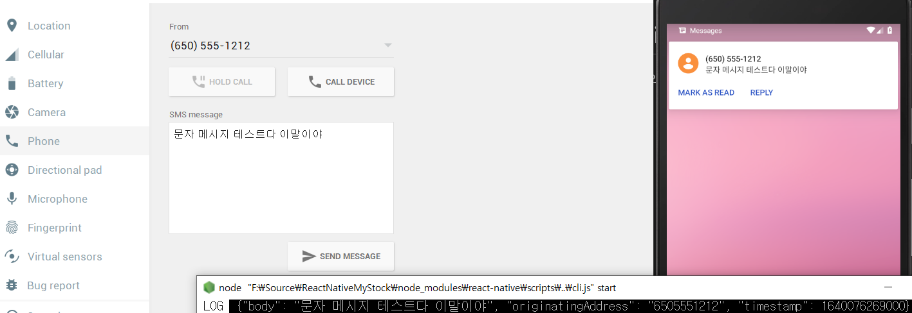

# React Native

문득 혼자 이런 앱이 있으면 어떨까? 하는 상상에서 시작해서 앱개발을 시작했다.  
원래는 Flutter를 배워보고 싶었는데 전에 시니어 개발자분이 react를 추천했던 것이 생각나서 react로 시작했다.  

앱 개발은 처음이라 어려울 것 같아서 겁먹었다.  
근데 구글의 도움을 받아가며 뚝딱뚝딱 만들어간다.  
나도 모르는 사이에 성장했던 걸까 생각하며 뿌듯하기도 했지만,  
2~3년 전에 React Native을 몇 달 개발해본적이 있어서 그랬던 것이었다.  
(이상하게 앱 빌드를 위한 개발환경이 다 세팅되어 있더라...)  

지금은 핵심 기능인 SMS가 도착하면 읽어들여서 자동으로 데이터를 입력하는 기능을 테스트해보고 있다.  
아직 잘 안 되어서 킹받지만, 어떻게 결국 해내긴했다.  

  

아직 완벽하지는 않지만 언젠가 완성해서 플레이스토어 링크를 공유하는 포스트를 올릴지도 모르겠다.