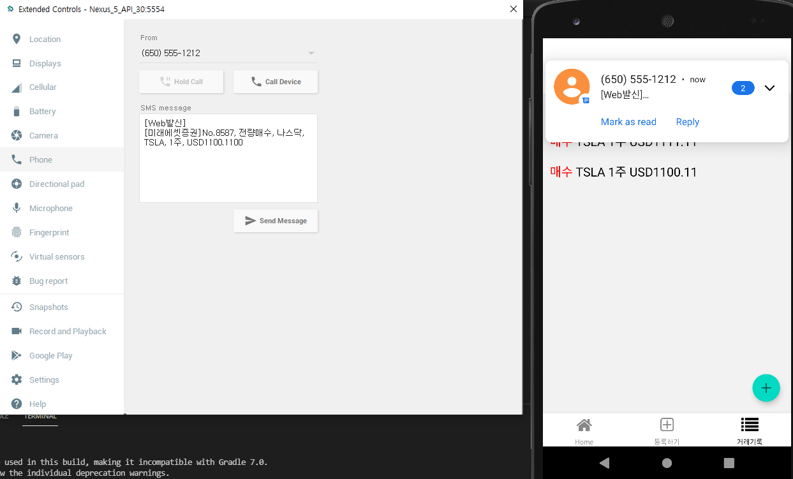

# SMS를 읽고싶다.

[이 포스트](https://jjester.tistory.com/176)에서 시작했던 앱 개발.  

개발자 친구에게 구글 정책으로 더 이상 SMS를 읽어올 수 없을거라는 말을 듣고 마음이 다급해졌다.  
호다닥 play store에 올려 비공개테스트를 진행해보기로 했다.  

아직 아이콘도 없는 앱을 설치하고 실행했다.  
두근거리는 마음으로 문자를 보냈다.  

... 아무반응이 없었다.😥  

왜! 안드로이드 스튜디오 AVD에서는 되는데 안 되는거야...  

며칠 동안 들끓었던 개발 의욕이 한순간에 차갑게 식어버렸다.  

