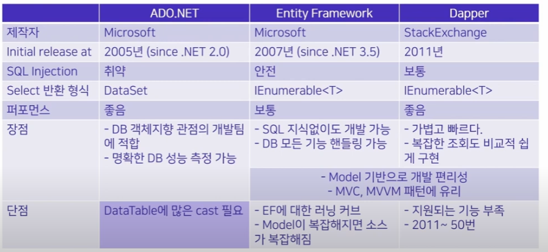

# [2022 .NET Conf.] ORM 특징

### EF
- Model Class를 관리한다면 효율적임.
- 성능 향상을 위한 Memory-optimized table 활성화 가능
- SQL을 몰라도 프로그램 작성 가능.  
=> 이게 EF의 가장 큰 문제가 되는 것 같다. 실제로 쿼리 성능 튜닝을 위해서 쿼리를 수정하는 경우가 필요하기 때문이다.
- 대량 업데이트에 적절하지 않음.

### Dapper
우리가 사용 중인 Dapper.
- `<T>`로 제공받은 model class를 반환
- model class 데이터 타입과 호환되지 않으면 에러 발생  
=> 오히려 장점임(오히려 좋아!). strong typing이 가능하다.
- SQL에 대한 이해가 필요하다.
- SQL Server에서 prepared query로 인식 => injection 예방
- DB 내 쿼리 구문 분석 과정 단축, plan cache를 재사용할 수 있는 확률이 높음.

### ADO.NET
- DataSet으로 반환해서 DataTable casting 필요.  
=> 그래서 DataTable => model Mapping관련 추가 기능의 개발을 했었다.

### 정리

### 성능 비교
조회(SELECT)로 테스트
- Dapper가 전반적인 성능이 가장 좋았다.  
- 1000건 까지 거의 차이 없었다.  
- 2000건 넘으면 EF의 duration이 커졌다.  