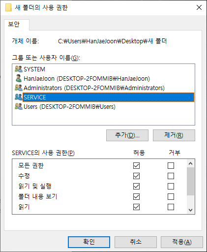

# [MS-SQL] SQL로 파일 이동/삭제하기(xp_cmdshell)

놀랍게도 SQL로 파일을 이동/삭제할 수 있는 방법이 있었다.  
`xp_cmdshell` 을 사용해서 윈도우 command를 활용하는 방법이다.  
- [윈도우 CMD 명령어 모음](https://zetawiki.com/wiki/%EC%9C%88%EB%8F%84%EC%9A%B0_CMD_%EB%AA%85%EB%A0%B9%EC%96%B4_%EB%AA%A9%EB%A1%9D)  

먼저 아래 쿼리를 실행해서 `xp_cmdshell` 사용을 설정해야 한다.  

```
EXEC sp_configure 'show advanced options', '1'
RECONFIGURE

EXEC sp_configure 'xp_cmdshell', '1' 
RECONFIGURE
```  

그리고 아래와 같이 사용하면 된다.  

```
DECLARE @cmd sysname;

-- 파일 삭제
SET @cmd = 'del "' + @RootDir + '\' + @FileName + '"';
EXECUTE sys.xp_cmdshell @cmd;

-- 파일 이동하기(@RootDir1 => @RootDir2)
SET @cmd = 'MOVE "' + @RootDir1 + '\' + @FileName + '" "' + @RootDir2 + '"';
EXECUTE sys.xp_cmdshell @cmd;
```  

단, `ACCESS IS DENIED` 에러가 발생할 수 있다.  
보안때문에 조작이 이루어질 폴더에 권한 설정을 해주어야 한다.  
아래와 같이 조작을 가할 폴더에 `SERVICE` 사용자를 추가하고 권한을 부여해야 한다.



[참고자료]
- https://www.mssqltips.com/sqlservertip/1020/enabling-xpcmdshell-in-sql-server/
- https://docs.microsoft.com/en-us/sql/relational-databases/system-stored-procedures/xp-cmdshell-transact-sql?view=sql-server-ver15