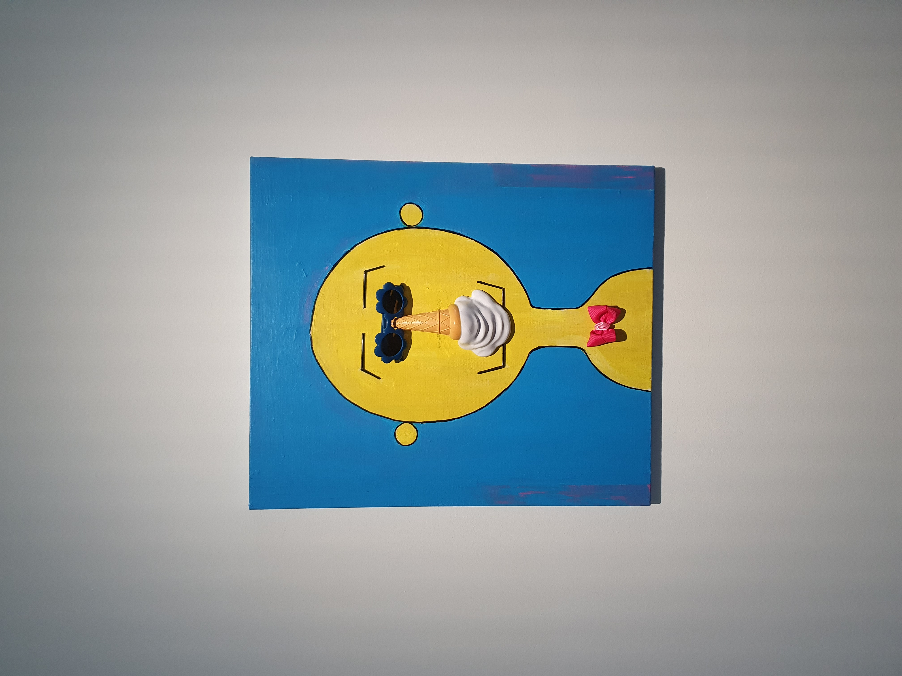
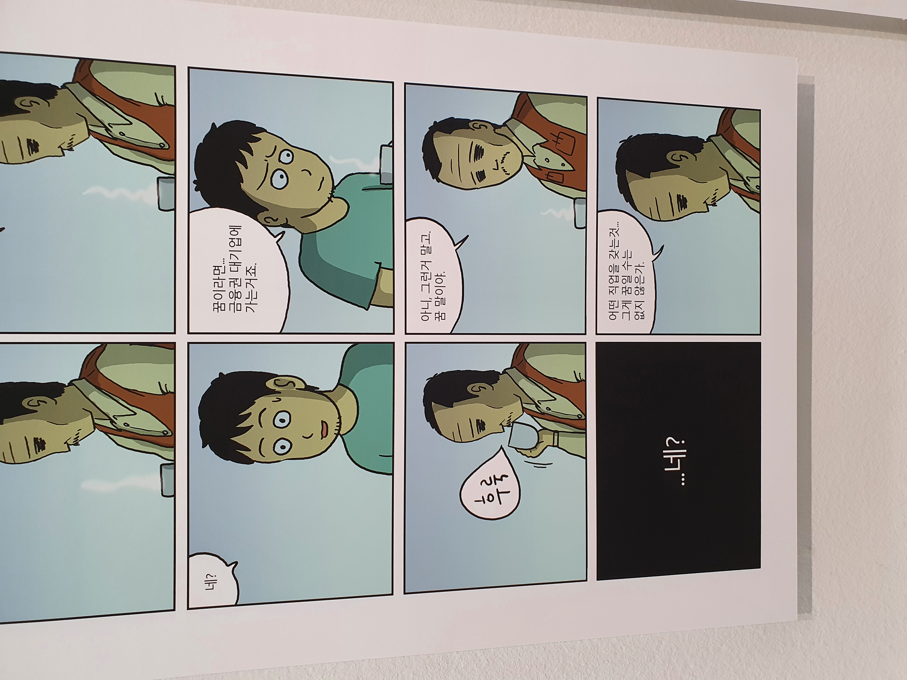

## 호민과재환

베조스 형님을 포함해서 존경하는 빡빡이 중 한 명인 주호민 작가와 그분의 아버님의 공동전시회에 갔다.

서울시립미술관 관람료는 무료였지만 주차비는 평일 400원/5분, 300원/5분으로 비싼 편이었다.  
주차비로 7200원이 나왔으니 총 2시간을 관람했다는 것을 추정할 수 있었다.  

주호민 작가님의 작품은 많이 봐왔으니 익숙했고 하이라이트를 전시해 놓은 느낌이었다.  
주재환 작가님의 작품은 처음에는 '이정도면 나도 예술해봐도 되겠는데..?' 라는 생각이 들었지만, 작품 설명과 전시 작품 월드컵에서 설명을 들으면서 작품 속에 시대를 비판하는 깊은 뜻이 있었다는 것을 느꼈다.

아래는 가장 감명받았던 작품이다.

주호민 작가님도 아버님처럼 현 시대를 살아가는 젊은이들의 변질된 꿈을 비판한 것은 아닐까?
내 꿈은 뭐였지..?