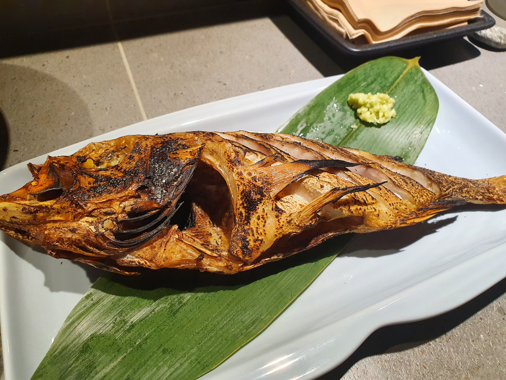

## 청주한씨

금요일 재량근무를 활용해서 한식 맡김차림(오마카세의 한국식 표현) 전문점에 갔다.  
두 번째 방문이지만 단골 가게처럼 익숙한 느낌이 든다.  
나도 한씨여서 그런가..?

> 대굴빡이 딱 우리 집안 사람 같더라고

청주한씨 입구  
초등학교때는 한씨가 맨날 출석부 뒤에 나와서 킹받았는데  
대학교때 나처럼 지각쟁이에게 그 것은 개이득이었다. 조상님들 땡큐!

놀랍게도 리코타치즈가 아니라 두부였다.  
리코타치즈도 섞은 것 같긴한데 맛있었다.

살면서 처음 먹어본 맛조개.  
다른 조개와 달리 먹을 게 많아서 좋았다.  
이것도 맛있었다. 

가지튀김  

갈비  

서비스로 주신 새우  

마지막 비빔국수  

중간에 추가로 시킨 뽈락구이  

전통주는 3병 마셨지만, 내 입맛에 가장 맞았던 술  
계피향이 은은해서 좋았다.  
물론 율주도 맛있었는데 사진을 안 찍었네;;

같이 갔던 한씨 친구는 술이 부족했는지 서울숲에서 맥주까지 먹자고 했다.  
반겨주는 서울숲 고양이들 쏘 큩😍  
얼마 전 어떤 정신병자 때문에 세상을 떠난 서울숲 고양이의 명복을 빈다.

