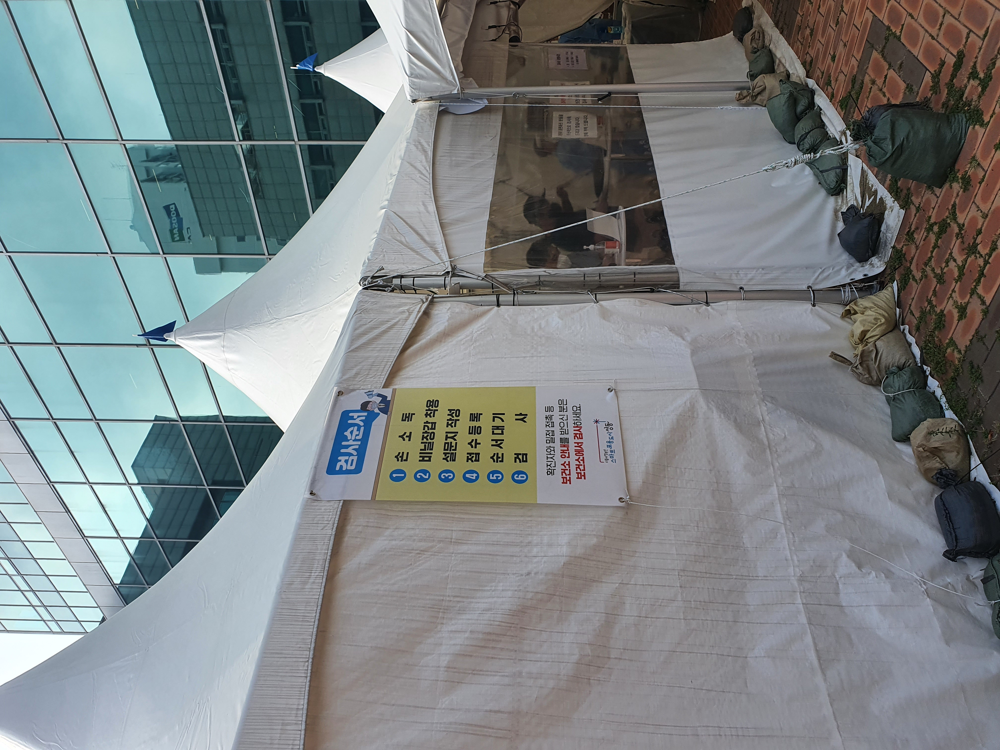

## 코로나19 검사 

우리 아파트 같은 동에서 확진자가 나왔다고 한다.  
근데 나왔으면 빨리 말해주던가...  
주말 다 끝나고 오늘 아침에서야 알려줬다.  

오전에 있던 운동도 취소하고 회사도 오랜만에 재택으로 전환하고 검사를 받고왔다.  

검사는 금방 끝났다.  
생각보다 아프지 않았다.  
마치 바다에서 수영하다가 바닷물이 코에 들어갔을때 통증 정도?  

아무튼 오랜만에 집에 가족들이 모두 있으니깐 고양이만 신났다.🐈  
업무를 하다보니 회사에 있는 와이드 모니터, 피벗 모니터의 소중함이 느껴졌다.  

검사 결과는 아직 나오지 않았다.  
내일 아침에는 나오겠지?