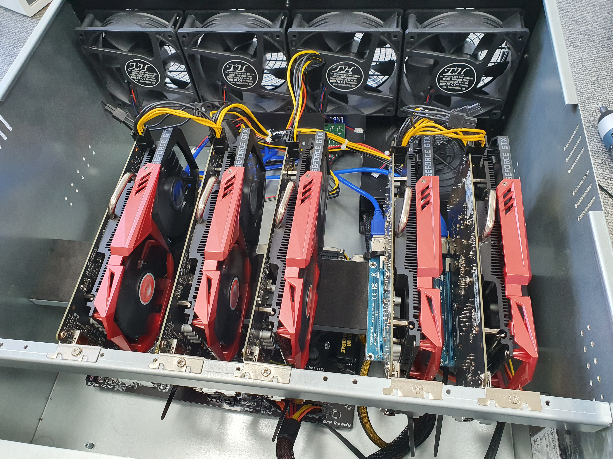
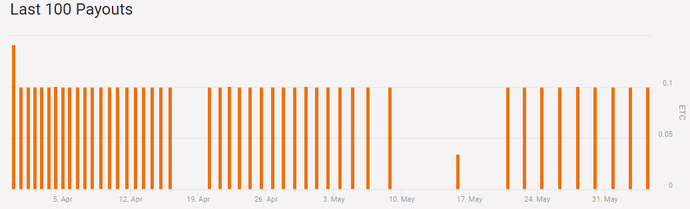

## 초보 채굴러  

채굴 3개월째 💎⛏

3개월 전 아~~~~무것도 모르는 채 gtx1050ti를 5개를 사서 채굴을 시작했다.  

이더리움을 채굴하겠다는 원대한 꿈을 꾸었지만 이 그래픽 카드로는 무리였다.  
정보를 너무 수집을 안 했다.😭  
어쩔 수 없이 채굴이 가능한 ETC를 채굴하고있다.

당시 코인의 상승과 맞물려서 꽤 수익이 되는가 싶더니  
4~5월 사이에서 채굴 난이도가 올랐는지 간격이 벌어지기 시작했다.  

3개월 동안 4.68ETC가 모였다.😂😂  
다시 팔리지도 않고... 그냥 천천히 모으기나 해야겠다.  
역시 섣부른 투자는 위험하다.