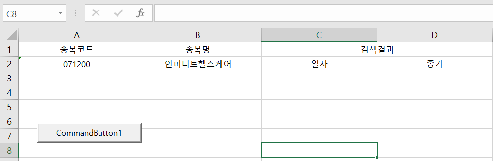
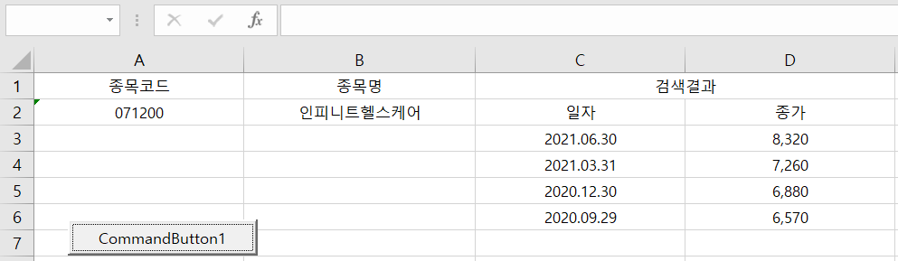

# 엑셀 네이버 증권 크롤링

채권평가사인 친구가 엑셀로 네이버 증권 크롤링을 한다고 해서  
무두절인 오늘 나도 한 번 만들어봤다.  
만들고 보니 모멘텀 투자에 괜찮을 것 같다.   

VBA 문법을 찾아서 개발했어야 해서 은근히 오래 걸렸다.  
API가 아닌 크롤링은 DOM element를 selector로 찾기 때문에 네이버에서 UI를 바꾸면 잘못된 데이터가 들어올 수 있다.  
그리고 원하는 데이터만 선별적으로 가져올 수 없기 때문에 너무 복잡하고 비효율적이다.  

개발을 할 줄 안다면 API를 이용하도록 하자!  
API로 개발한 VAA 계산기도 흥해라!  
https://quant-jj-vaa.herokuapp.com/

### 사용방법  
종목코드를 입력하고 버튼을 누르면  

최근 4분기의 종가를 확인할 수 있다.
