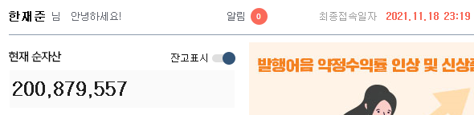

# 30살 전에 1억 모으기 후기

> 사회생활 5년 내에 1억을 모아라.

[이 영상](https://youtu.be/Q-laQu1IUIg)에서 강환국 형님이 하는 말이다.  
2017년 겨울 25살의 나는 환국 형님을 알기 전이었지만 나도 그렇게 생각했다.  
최대한 시드머니를 빨리 모아야 한다고 생각했기 때문이다.  
그래서 30살이 되기 전에 1억을 모으기로 결심했다.

그렇다면 어떻게 모을 것인가?  

당시 연이율 5% 6개월짜리 적금이 유행하고 있었다. 내가 받게될 이자는 몇 퍼센트일까?  
정답은 2%도 안 된다.  

연이율 5% 1년 짜리라고 가정해보자.  
첫 달에만 온전히 5%의 이자를 받을 수 있다.  
마지막 달에는 한 달만 은행에 맡기므로 연이율의 1/12을 받게된다.  
```
5 * 12/12 + 5 * 11/12 + 5 * 10/12 + ... + 5 * 2/12 + 5 * 1/12
```
이자 세금 15.4%까지 계산하면 결국 5%의 반인 2.5%에도 못미치게 된다.  
심지어 6개월짜리 적금이었으니 더더욱 이자는 낮아진다.  

결국 주식밖에 없었다.  
대학생때 처음 주식을 시작하고 대선 테마주도 해보고, 리딩방에도 들어가보고, 친구의 말만 듣고 사서 때로는 익절도하고 손절도 해보면서 점점 나만의 철학이 생겼다.  
나에게 친숙한 기업이면서 배당을 주는 기업들을 모아가는 투자를 시작했다.  

사회생활 1년 후 내 수익률은 15%를 기록했다.  
(지금 생각해보면 SPY나 살껄 후회된다)  
연 2000만원을 주식에 쏟아 넣으면서 이 수익률을 유지한다면 4년이면 1억이 살짝 못 미치는 금액이 된다.  


