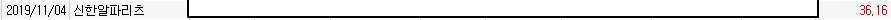

# 중개형 ISA 그리고 국내 리츠

### 중개형 ISA

납입한도: 2000만원/연(납입한도는 다음 해로 이월 가능)  
총 한도: 1억원  

국내 주식/펀드 순익 통산 순소득 **일반형 200만원/서민형 400만원까지 비과세 혜택이 있다.  
이후 초과분은 9.9% 분리과세 된다.**  
의무가입기간은 3년이다.

2023년부터 5000만원을 초과하는 금융소득에 대해 양도세가 적용된다.  
미리 중개형 ISA 계좌를 만들어서 준비하자.

[납입한도 조회하기(미래에셋)](https://jjester.tistory.com/166)

### 리츠  

현재 국내 공모리츠를 **3년 이상 보유하는 경우(최대 5000만원)**
**3년간 배당소득에 대해 9% 분리과세 혜택**이 있다.  
(원래는 배당소득세 15.4%)

---  

> 손님, 절세효과가 있는 리츠를 갈아서 절세효과가 있는 ISA 중개형 계좌에 뿌려서 드셔보시겠습니까?  
> 예.

바로 자리에서 일어나서 회사에서 거래할 때 자주 이용하는 계단으로 향했다.  
마침 국내 전략을 정리했던터라 현금이 있어서 중개형 계좌로 이체했다.  
과거 좋은 추억이 남아있던 신한알파리츠를 포함한 5개의 리츠를 매수했다.  

  

판교 알파돔에서 마셨던 쑥라떼가 생각난다.