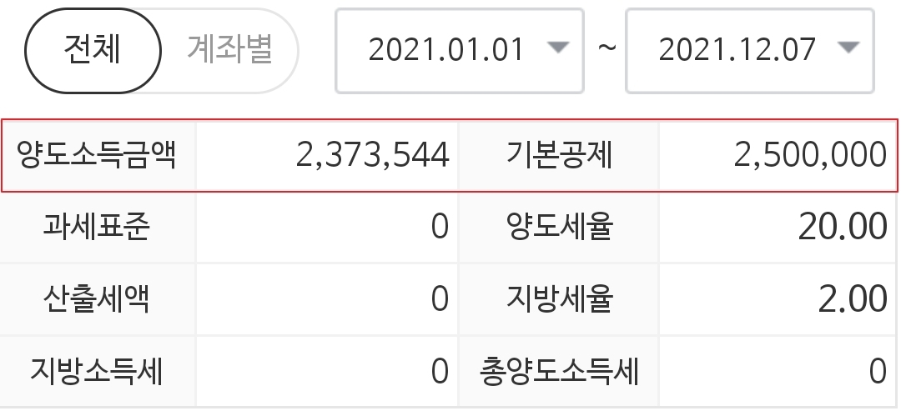

# 해외주식 양도소득세

흔히 찬 바람이 불면 배당주를 떠올린다.  
우리나라는 배당 기준일이 12월인 기업들이 많아서 그렇다.  
하루만 주식을 가지고 있어도 다음해 3~4월에 배당을 받을 수 있다.  

반면 미국에는 분기 배당을 실시하는 기업이 많다.  
분기 혹은 월마다 배당을 받기 때문에 굳이 12월 배당락을 생각하지 않아도 된다.  
대신에 해외주식은 12월이 되면 양도소득세를 생각해야 한다.  

### 양도소득세 

**1년간의 손익을 합산해서 250만원까지 공제해주고 그 초과분은 22%의 양도소득세를 내야 한다.**  

예를 들어서 총 350만원의 수익을 냈다고 가정하면,   
250만원을 제외한 100만원에 대해 22%, 즉 22만원을 세금으로 내야 한다.  

도둑이 따로없다.😩  

참고로 아래와 같이 편하게 MTS에서 양도소득금액을 간편하게 확인할 수 있다(미래에셋 기준).  

  

양도세를 최소화하는 유명한 방법이 있다.  
**마이너스인 종목들을 팔았다가 다시 사는 방법이다.**    
보유 종목은 변함없지만, 손절을 통해 소득금액을 250만원 아래로 낮추는 방법이다.  
약간의 거래 비용이 발생한다.  

나도 미리 손절작(?)을 통해 250만원 아래로 낮춰놓았다.  
하지만, 생각해보니 다른 증권사에서 발생한 수익을 계산하지 않았다...  
**여러 증권사를 사용하는 경우에 계산이 누락되지 않도록 주의해야 한다.**  

그리고 자료를 찾다보니 **2020년 1월부터 국내/국외 주식이 손익이 통산이 허용된다([참고](https://www.nts.go.kr/nts/cm/cntnts/cntntsView.do?mi=12274&cntntsId=8800)).**  
그런데 국내 손익통산이 허용된다는 말이 둘 다 이익이 발생하면 통산을 안 해도 되는건지 모르겠다.  
=> 이건 국세청에 문의를 해봐야겠다.  

국세청 좀 제대로 적어주면 좋겠다. 심지어 홈페이지의 사례도 잘못됐다(기본 공제액 계산 누락).