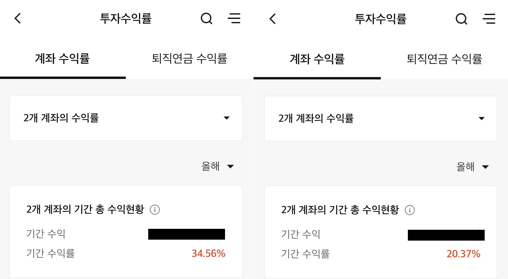

# 2021년 투자 결산

방금 HTS에서 모든 거래내역을 엑셀로 추출해서 수동으로 결산을 마쳤다.  
테스트했던 전략들을 제외해봐도, 배당금도 더해보고  
진짜 별 짓을 다 해봐도 S&P 500의 올해 수익률을 이길 수 없었다.  

정말 추하지만... S&P 500 이긴적도 있었다고!!  
비트코인 1루타 친 것도 여기에 포함 안 되어있다고!!  
그냥 비긴걸로 하지 않을래?  

다행히 11월 17일에 친구에게 보낸 스크린샷이 남아있어서 증거로 제출한다.  
1.5개월 사이에 14.56%p는 어디로 갔을까?😥  

내가 구독하는 블로거들의 수익률은 기본 30~40%인 것 같다.  
역시 투자 책을 집필하거나 경제적 자유를 누리려면 저 정도는 되어야 하는구나 싶다.  

**아무튼 올해는 가치투자 비중을 50%를 줄이고 대신 SPY를 살 예정이다(비긴거니깐😅).**  

내가 하도 슬랙에서 SPY 노래를 부르니깐 친구가 그냥 SPY나 사라고 한다...  
나는 내년에도 시장에서 구르고 깨지면서 성장해서 결국 S&P 500를 뛰어넘을 것이다.  

---

## 2021년 투자 결산  

### 배당(세후)  

- 원화: 138,010원
- 엔화: 36,584엔
- 달러: 467달러

### 기타수익  

- 원화: 124,933원(대차수수료, 유상감자)
- 달러: 64달러(인수합병)
- 가상화폐 채굴: 10.5603 ETC
- 블로그 광고: 17.27달러

### 명예의 전당  

- 1루타(100%): 현대차, LS, BTC(비트코인), 대동기어, 정원엔시스, 서전기전, SK바이오사이언스
- 2루타(200%): 이루온

### 내가 뽑은 올해 최고의 종목  

**MSFT**  
azure 매출에 힘입어 잠시 시총 1위를 되찾기도 했던 MS.  
전체 잔고에서 가장 높은 수익을 기록중.  

### 내가 뽑은 올해 최악의 종목  

**엘앤씨바이오**  
내 계좌 수익률이 유일하게 마이너스였던 구간을 안겨줌.  
남의 말만 듣고 투자 금지!  
단일 종목 몰빵 금지!  

### 내가 뽑은 올해의 ETF  

**QQQ**  
역시 미국이다. 역시 기술주다.  
현재 80%를 넘어가는 수익률을 기록중.  

### 내가 뽑은 올해의 배당주  

**SoftBank Corp(9434)**  
늘 짜릿한 배당 입금 문자. 아직도 6%에 육박하는 배당률.  

### 내가 뽑은 올해의 공모주  

**SK바이오사이언스**  
169.86% 수익률을 기록. 근데 2주만 배정 받았었음.  

### 내가 뽑은 올해의 상한가  

**현대비앤지스틸**  
우연히 재무제표만 보고 선택했던 투자했던 종목.  
원래 추천도 잘 안 하는데 심지어 친구들에게 추천까지 했음.  
직접 선별한 종목이 상한가를 갔을때 너무 짜릿했음.  

### 내가 뽑은 올해의 전략  

**폭락장 후 한국 대형주 싹쓸이 전략**  
폭락 후 저 PBR + 고배당 + 시총 상위 주식 매수  
1년 후 든든한 수익률 그리고 달달한 배당.