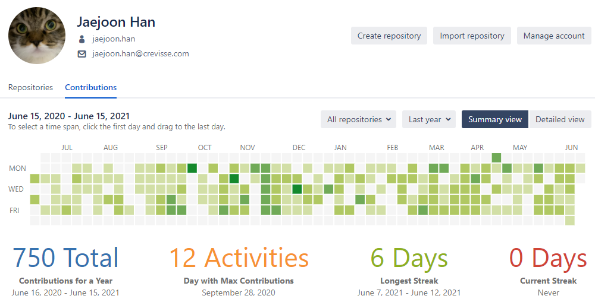

## 2021 상반기 회고

이직을 하고 딱 1년이 되는 날이다.  
시간 참 빠르고 많은 일이 있었다. 기념으로 Bitbucket의 잔디를 기록해본다.  
이직 2일 차부터 commit을 시작했다. 5월에 마이그레이션에도 미세하게라도 이어진 것이 인상적이다.

인사평가 시즌이니 6개월을 뒤돌아보자.

### ~1월: pdf 모듈 변경
기부금 영수증을 발행할 때 사용하는 pdf 모듈을 변경했다.  
HTML을 pdf로 변환하는 것에서 백엔드 코드로 바로 pdf 문서를 생성하도록 변경했다.  
성능도 개선되어서 연말에 몰려오는 cs가 줄었다고 한다.  

### 1월: API 개발
결제 페이지에서 요청하는 API의 인증 로직을 개발했다.  
C# Attribute 유무로 제어할 수 있도록 개발했다.  
프론트앤드 개발자와의 처음이자 마지막 협업이었다.  

NICE 카드 청구 테스트용 API를 개발했다.  
그동안 테스트를 해볼 수 없었던 로직이 가능해졌다.

### 1월 ~ 2월: 성능개선
엑셀파일 업로드 성능 개선을 진행했다.  
불필요한 로직 제거, 쿼리 200개씩 bulk로 실행 등으로 두 가지 로직에 각각 7배, 25배 성능을 향상시켰다.  
하지만, 반년 후인 지금도 간헐적으로 성능 문제가 발생하고 있다.😅

SQL 튜닝을 공부하고 제품에 적용했다.  
FAST N OPTION, SQL Parameter 이용으로 Query store 튜닝 유도, 통계 페이지 ROLLUP으로 성능 개선, Legacy CE 힌트, 불필요한 조인 제거, 인덱스 생성 등등.  
하지만 끝이 없다. 요즘도 문제가 생기는 족족 튜닝하고 있다.

### 2월 ~: 다른 팀의 생산성을 위한 개발과 프로젝트 시작
관리자 페이지를 자주 사용하는 팀을 위한 개발 위주로 기능 개발을 진행했다.  
세일즈팀이랑 처음 일해본 경험이었고, 이런 팀을 위한 개발은 좀 더 자주하면 좋을 것 같다.  

새로운 프로젝트가 시작되었다.  
어렵지 않지만 대규모 변경이 있었다. 제품 전체에서 DB 테이블명, 변수명, 용어 변경.  
단, 일부 페이지를 제외해야 하고 기부금 관리 시스템에서 fund로 시작하는 단어는 너무 많았다.  
하지만, 과거에 투덜거리며 배웠던 정규식이 나를 살려줬다. 정규식을 이용한 Replace All로 쉽게 해낼 수 있었다.  
API를 사용하는 고객에게는 한 달간의 과도기를 줘서 변경 전, 변경 후 parameter를 모두 제공했다.  
고객에게 미리 공지할 수 있었고, 시간도 주었기 때문에 그만큼 부작용이 적었다.  

이때부터 내가 고치고 싶었던 것들을 함께 고쳐서 배포하는 혼자만의 `끼워팔기 배포` 프로젝트가 시작되었다.

### 4월 ~ 6월: 프로젝트 진행(기능 개발, 마이그레이션)
프로젝트에서 필요한 모든 신규 기능들을 작년에 내가 개발한 프레임워크 구조로 개발했다.  
채용도 진행해서 신입 개발자가 앞으로 보고 배우고, 개발할 표준이 될 기능이기에 공들여 개발했다.  

DB 마이그레이션을 진행했다.  
처음 맡게된 이관 업무이기 때문에 부담이 꽤 있었다.  
My SQL -> MS-SQL로 이종(?) DB간의 마이그레이션이 편하게 되는 것도 신기했다.  
마이그레이션 쿼리는 노가다성이 짙어서 SQL 지식보다는 도메인 이해도가 한층 깊어졌다는 것이 수확이다.  

wijmo tree view를 리서치해서 적용했다.  
현재는 wijmo olap을 활용한 pivot 테이블을 리서치 중인데 UI 때문에 죽을 맛이다.  
라이브러리는 pivot 기능에만 초점을 맞춰 개발되었고, 우리는 `예쁘게` 보여줘야 하니깐 말이다.  
event가 너무 복잡하게 얽혀서 잘못하면 무한 event의 loop에 빠진다.  

이 문제를 2일 안에 풀지 못하면 이번 주 목요일 삼척 여행은 매우 찝찝할 것이다.