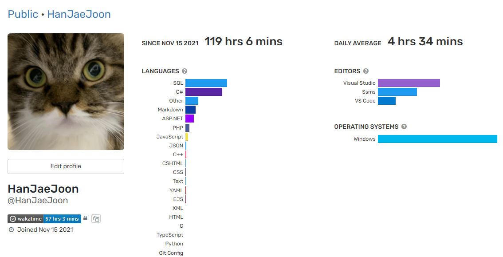

## 2021 하반기 회고

어느새 돌아온 인사평가 시즌이다. 다시 6개월을 뒤돌아보자.  

### 6~8월: SNUF 프로젝트
DB 업데이트를 진행하며 데이터 마이그레이션을 마무리했다.  
OLAP 기능을 모듈화해서 신입 개발자가 다양한 통계 화면을 찍어낼 수 있는 구조를 만들었다.  
하지만 열심히 통계를 찍어낸 이후 그 신입 개발자는 정직원 전환에 실패했다...  

검색 필터가 적용된 검색 결과의 기간동안 집계된 값을 검색할 수 있는 기능을 개발했다. 예를 들면, 2021년 동안 신용카드로 결제된 금액의 합이 100만원을 넘는 약정이 있는 구성원을 검색. 이 기능과 함께 엑셀 출력 기능의 새로운 아키텍쳐를 만들었다.  

내가 개발했던 request parameter binding 관련 아키텍쳐에서 늘 걸리는 부분이 있었다.  
.NET Web API Controller에서 model이 아닌 primitive type의 parameter binding 동작에서 post request의 경우에만 제대로 binding 하는 문제가 있어서 조회에서도 post request를 사용해야 했었다.  

마침 하반기에 합류했던 시니어 개발자분에게 배운 문제해결 방법이 있었다.  
먼저, 개발을 멈추고 문제 상황을 정확히 인지한다. 그리고 문제 상황이 발생하는 원인(병목)을 찾는다. 그 원인을 해결한다.  

모든 테스트 케이스에 대해서 동작 확인을 해봤다.  
결과는 굉장히 이상했고 이미 다른 유명한 오픈소스 컨트리뷰터들은 알고 있었던 이슈였다.  
이 부분은 우리가 어떻게 해서 될 일이 아니었고, MS에서 수정을 해줘야 하는 문제였다.  

앞으로 팀에서 사용하게될 fetch, URLSearchParams에 대해서도 모든 경우에 대해 테스트를 해보고 결국 조회에 post request를 쓰는 것이 나쁜 것만은 아니라는 결론을 내렸다.  

어떻게 보면 당연한 문제해결 방법인데 늘 고민이 깊어지다보면 원래 목적을 잊게되는 것 같다. 잠시 고민을 멈추고 문제의 원인을 정확히 파악하는 것이 중요하다는 것을 배웠다.  

이와 비슷하게 팀 내부적으로 진행중이던 DDD 디자인 패턴 적용도 근본 원인을 생각해보니 불필요하다는 결론도 내려지기도 했다.

### 9~10월: MSFK, CNUF, YWCA 프로젝트
이후 대형 프로젝트들이 예정되어 있었다.  
후원자들이 많이 유입될 것으로 예상이되어 Nice 카드 결제 API를 batch 처리되도록 변경하는 작업을 진행했다. 결제 준비, 결제, 모니터링, 결과보고 모든 것에 대해 내가 직접 설계하고 개발했다. window scheduler로 매일 진행되던 정기 결제를 Azure Functions로 변경하는 작업을 진행했고 CI/CD 파이프라인을 구축했다.  

동시에 CNUF 프로젝트에서 DB migration을 진행했다.  
on-premise 제품의 기능 개발도 있었는데 매번 전화로 VPN 접속을 허가받아야 했고, 소스코드도 구려서 다시는 하고싶지 않았다.  
BulkCopy라는 획기적인 insert 성능을 가지는 기능을 발견했다.  
15만 건의 insert가 1초도 안 걸려서 엄청난 성능 개선을 할 수 있을 것 같았다.

제품의 excel로 데이터를 import하는 기능이 있었는데 여기에 BulkCopy를 적용하면서 성능 개선으로 YWCA 프로젝트를 지원하기도 했다.
위의 Batch API에서 Nice에서 받아온 bulk data 결과를 우리 DB에 insert 할때도 적용하기도 했다.  

아마 이 BulkCopy의 발견이 하반기 최고의 성과가 아닐까 싶다.  

### 10~12월: MSFK 프로젝트
돌아온 DB migration 쿼리 작성의 시간.  
MSFK는 역대 고객 중에서 가장 많은 데이터를 갖고있었는데 놀랍게도 DB -> DB migration이 아니라 excel -> DB migration으로 진행되었다.  
엑셀파일이 너무 용량이 커서 SSMA(SQL Server Migration Assistant)나 SSMS의 excel import 기능으로도 DB로 insert가 불가능했다.  
SSIS(SQL Server Integration Services)를 이용해서 DB로 import할 수 있었다.  

이전에 개발했던 Batch API를 배포했고, 기능별로 단계적으로 적용을 해나가고 있다. 현재는 Batch API의 결과보고를 안정화하는 작업을 진행중이다.

--- 

파트장이 된 후 첫 반기를 마쳤다.  
첫 번째 파트원은 결과가 좋지 않았지만 나는 항상 두 번째 도전에 강하니깐...  
지금 있는 파트원과 1월에 합류한 두 번째 파트원은 오래일할 수 있도록 해야지.

11월부터 wakatime으로 개발 시간을 측정하고있다.  
당시 migration 쿼리를 짜고 있었어서 아직도 SQL이 압도적이다.  

올해는 DB migration을 3번을 진행했다.  
정말 재미없고 지루한 과정이지만 중요한 과정이니깐 해야지(까라면 까야지)...  
기능 개발도 많이 했지만, 특히 하반기에는 아키텍처 개발을 많이 하게 된 것 같다.  
아키텍처도 얼른 개선해서 .NET 6로 넘어가는 쾌거를 이루고싶다.
내년에는 C#이 압도적이기를 바란다.