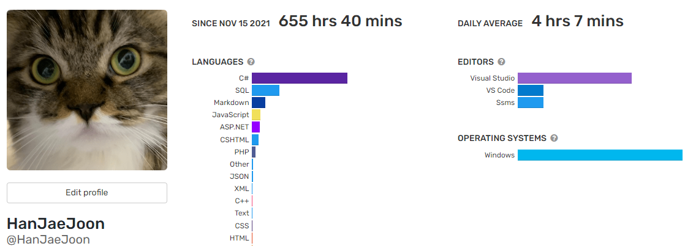

## 2022 상반기 회고

어느새 또 돌아온 인사평가 시즌이다. 다시 6개월을 뒤돌아보자.  
wakatime을 보면 역시 C#이 SQL을 역전을 했다.  
요즘은 블로그 글을 잘 안 쓰게 되어서 .md 파일은 작성이 많이 줄었다.  
다시 TIL 열심히 해야지!

  

### 2021년 12월 ~ 2022년 2월: 서비스 안정화

대형 고객의 막대한 양의 데이터에 따른 안정화 위주의 업무를 진행했다.  

OTP 인증 문자/카카오톡 발송 모듈의 이중화 작업을 진행했다.  
먼저 json 파일로 저장해서 처리되고 있던 것을 DB로 처리할 수 있도록 변경했다.  
메시지 모듈을 2개 설치해서 OTP 전송 등 빠르게 전송이 필요한 메시지의 전송 로직을 분리했다.  

Nice 결제 모듈에 적용된 Batch API 기능의 안정화를 진행했고 자동 재시도 로직, 모니터링을 강화했다. 이제 대부분의 기관이 Batch API를 사용하고 있다.  

엑셀 다운로드 로직의 메모리를 효율적으로 사용할 수 있도록 수정했다. 엑셀 다운로드가 30만 건도 충분히 가능하도록 수정했다. VS에서 memory 사용량을 디버깅하고, 가비지 콜렉터 기능과 메모리 절약을 위한 Collection 등을 활용했다.  

### 3월 ~ 4월: Azure Storage - Blob Storage 적용

기존에 네트워크 드라이브에 있던 file storage를 Azure storage의 blob storage로 변경하는 작업을 진행했다. 이것 또한 서비스 안정화 작업의 일환으로 진행했다.  

추가로 파일 다운로드나 mp3 파일 압축 등을 하는 경우 기존에는 네트워크 드라이브에 파일을 저장하고 그 파일에 다시 접근하고 읽고 수정하는 구조였는데 이제 바로 memory stream으로 진행할 수 있도록 개선했다.  

아직 다른 개발자가 개선을 맡고 있는 부분이 있어서 그 부분을 제외하고 모든 제품에 적용했다. 아마 올해 안에 나머지도 blob storage로 변경할 수 있을 것 같다.

### 4월 ~ 6월: .NET 6 업그레이드 준비

MVC 구조 적용을 진행하면서 동시에 나는 .NET 6 업그레이드를 위한 리서치를 맡았다.  

적용된 것
- ViewBag => ViewData 변경
- Web API에 모두 .NET 6에서 필요한 방식으로 변경
- ISession migration을 위해 Session 데이터 json으로 저장하도록 변경

리서치한 것
- User별로 DB context를 Injection 받아 사용할 수 있도록 DI factory 프로토타이핑 
- Datadog, 각종 library, dll 동작 테스트
- BackgroundWorkItem 사용법(IBackgroundTaskQueue) 리서치

### 5월

새로운 PG사의 청구 모듈 도입 검토를 진행했고 개발을 거의 완료했지만, 상대 업체의 기술력 부재로 인해서 중단되었다.  

쓰고 싶은 말은 정말 많은데 하나만 하자면  
결제를 요청하고 그 것이 성공했는지 확인하기 위해서는 1일이 소요된다.  
별도의 테스트 환경이 없다.  

하반기엔 더 기술력 좋고 소통도 잘하는 좋은 업체가 있겠지!  

### 1월 ~ 6월: MVC 구조 적용

기존 Webform 방식으로 개발된 모든 페이지를 MVC 패턴으로 변환할 수 있도록 MVC Controller 등 아키텍처를 설계했다.  
공통 Layout과 partial view 먼저 변환하고 나머지 약 300개의 페이지들을 신입 개발자 2명과 함께 전환했고 드디어 6월에 완료해서 기념으로 개발팀 회식까지 진행했다.  

과거에 window scheduler로 호출하던 부분도 Azure functions로 모두 전환되었고 API를 code behind에서 처리했던 부분도 Web API Controller로 모두 전환해서 모두 json으로 통신할 수 있도록 변경되었다. 속이 다 시원하다.  