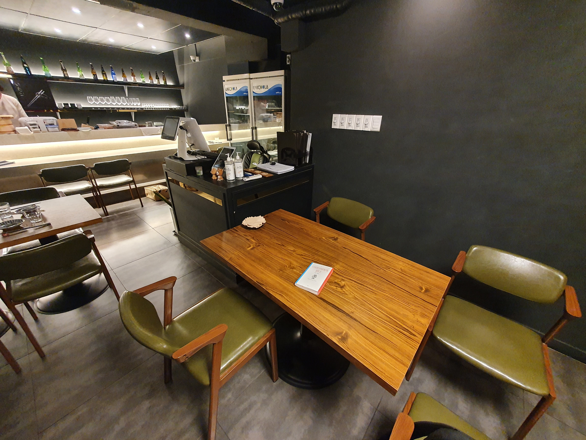
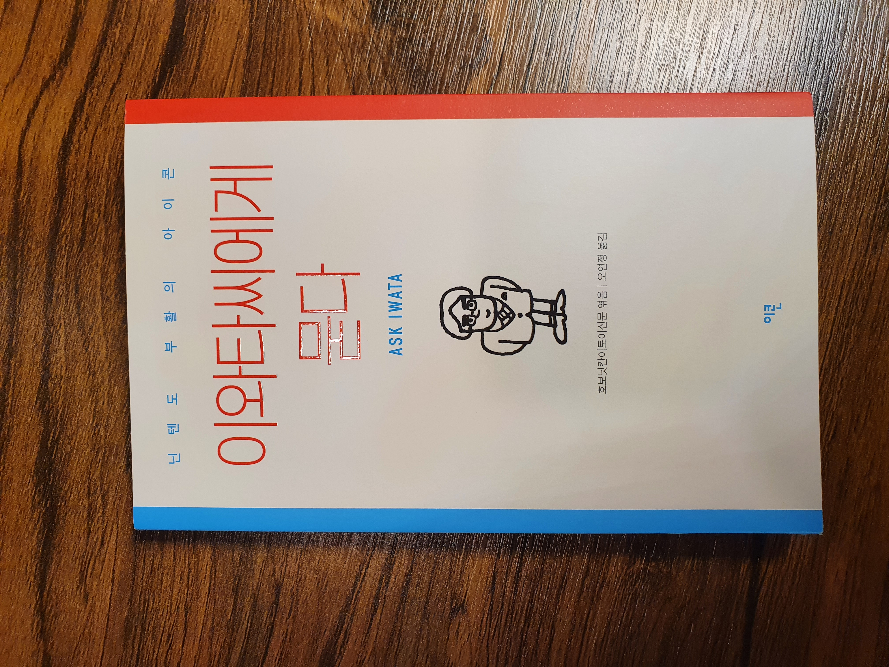

## 이와타씨에게 묻다

주말마다 열리는 잠실 이치고 북클럽.  
아직은 이치고 사장과 나 밖에 없지만 점점 인원을 늘려나갈 예정이다.  

음식점에서 독서라니 색다르지만 은근 집중이 잘 된다.  
오늘 읽은 책은 바로 `이와타씨에게 묻다`  

나는 닌텐도 게임을 해본 적은 없지만  
여동생이 닌텐도 DS, 3DS, 위, 위 피트, 스위치까지 살 정도로 닌텐도를 하는 걸 보면 얼마나 대단한지 간접 체험할 수 있다.  

개인적으로 이와타의 경영 능력에 대한 이야기보다 그가 프로그래밍에서 배운 것들을 경영에 녹여낸 부분이 더 기억에 남는 책이었다.  
책을 읽고 그에 대해서 검색해봤을 때, 오히려 프로그래머 선배로써 더 배울 것이 많아 보였다.  

--- 

1
> 자신이 쏟아부은 노력이나 에너지보다 보상이 더 크다고 느끼면 사람은 그것을 그만두지 않습니다.  
> 하지만 되돌아온 보상이 대가로서 걸맞지 않다고 느낄 때 사람은 좌절하지요.  

이와타는 이 말이 `그만두지 않고 계속하는 게임`의 조건이라고 했다. 하지만 나는 이 부분이 매니징에서 적용된다고 생각한다.  
적절한 보상은 노력하는 직원이 더 노력하게 되는 원동력이 될 수 있지 않을까?  
반대로 적절한 보상이 없다면 노력하는 직원이 떠나버리는 참사가 발생할 수 있다.

2
> 재능이란, '보상을 찾아내는 능력'이지 않을까요.  
> '끝까지 해내는 것'보다도 '끝까지 해낸 일에 쾌감을 느끼는 것'이 재능이라고 생각합니다.  
> 말하자면 보상을 찾아내는 '보상 발견 회로'와 같은 것이 열려 있는 사람이지요.  

내가 프로그래밍에 빠지게 된 이유도 어려운 문제를 고민 끝에 해결해 냈을 때 느껴지는 성취감 때문이었다.  
나는 끝까지 해낸일은 많지 않지만, 나에게는 그 성취감이 보상이었던 것 같다.  

3
> 시스템이 작동하지 않으면 무조건 틀린 거에요.  프로그램이  
> 사람들과 대화가 잘 안 되면 '이 사람 뭘 모르네'라고 생각하기 전에, '내 쪽에서 잘못했겠지'라고 생각합니다.

정말 공감이 된다. 컴퓨터는 거짓말하지 않는다. 늘 잘못된 쪽은 내 쪽이다. 이 자세를 소통에도 확장해서 상대방이 이해하지 못하면 '내가 이해를 잘못시켰겠지'라는 자세를 가져야 겠다.  

4
> 합리적이라고 생각하는 일에는 지체 없이 각오를 다진다.  

좋은지, 싫은지, 힘든지 쉬운지를 따지지 않고 합리적인지 아닌지를 생각해야 하고 합리적이라면 스스로 최선을 다하라는 말이다.  
나도 미래에는 실무에서 점점 손을 놓을 것이고, 동료에게 맡기는 일과 내가 직접해야 할 일을 판단해야 할 일이 많아질 것이다. 그때까지 어떤 것이 합리적인지 판단할 수 있는 능력을 기르고 싶다.

5
> 프로그래머는 노(No)라고 말해서는 안 된다.  

무조건 안 된다고 말하지 말고, 할 수 있지만 어떤 부분이 trade off인지를 설명해야 한다는 것이다.  

이와타와 이유는 약간 다르지만 비슷하게 생각하고 있었다.  
가장 건방져지기 쉬운 2년차 때 온전히 개발로 못하는 것은 없다고 생각했기 때문이다.  
불가능한 것이 있다면 유지보수성 측면에서나 정책적으로 불가능한 것들만 있다고 생각하기 때문이다.  
그 부분을 다른 팀에게 어떻게 잘 이해시키면 좋을지가 관건인 것 같다.  

어차피 다른 팀에게 말해도 이해 못하니깐, 아니면 단순히 개발은 할 수 있지만 자신이 귀찮고 힘드니깐 등등의 핑계로 많은 개발자들이 이를 잘 지키지 못한다.  
짧은 경력이지만 이런 정보의 불균형이 발생하면 결국 갈등이 많이 발생하곤 했다. 솔직하고 투명한 소통을 통해 갈등을 예방할 수 있지 않을까.